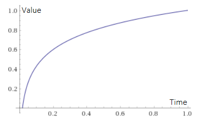
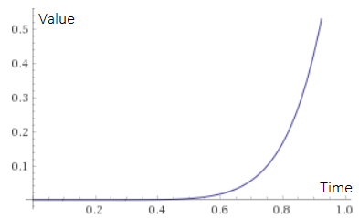

# Virus
Virus spread

C++ program, showing virus spreading. Just little think right now.
The point is OOP - try to use Object to run this task. 

Virus Spread :
* y = 1/4 * log(t) + 4 

Virus clean :
* y = t^2

> t = [0 : 1]

